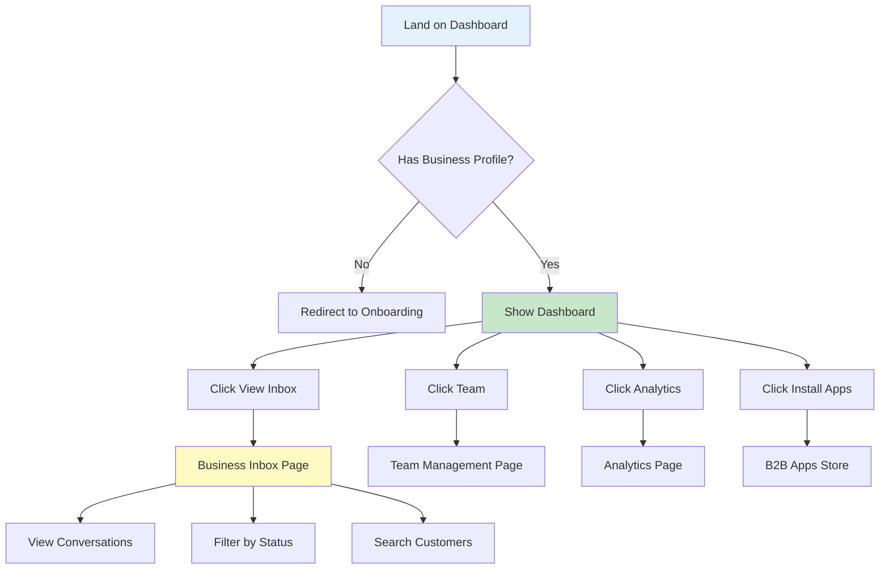

# 📱 Chatr Business Dashboard - Visual Mockup & Design System

## 🎨 Design Philosophy

The Business Dashboard follows Chatr's modern, clean aesthetic with:
- **Glass morphism** effects for depth
- **Gradient accents** for visual hierarchy
- **Card-based layout** for modularity
- **Mobile-first responsive** design
- **Professional yet approachable** feel

---

## 📐 Overall Layout Structure

```
┌─────────────────────────────────────────────────────────┐
│  HEADER BAR (Fixed)                                     │
│  ┌──────┐  Acme Corp ✓                     [Settings]  │
│  │ Logo │  Retail Store                                 │
│  └──────┘                                               │
├─────────────────────────────────────────────────────────┤
│  MAIN CONTENT AREA                                      │
│                                                          │
│  Quick Actions (Grid 4 cols)                           │
│  ┌──────────┐ ┌──────────┐ ┌──────────┐ ┌──────────┐ │
│  │ 💬 Inbox │ │ 👥 Team  │ │ 📊 Stats │ │ ➕ Apps  │ │
│  │  5 open  │ │ 3 users  │ │ Insights │ │ Install  │ │
│  └──────────┘ └──────────┘ └──────────┘ └──────────┘ │
│                                                          │
│  Stats Overview (Grid 4 cols)                          │
│  ┌────────────┐┌────────────┐┌────────────┐┌──────────┐│
│  │ 💬 Total   ││ 👥 Team    ││ ⏱️ Avg Time││ 📈 Growth││
│  │    12      ││     3      ││    15m     ││   +0%    ││
│  │ convos     ││ members    ││ response   ││ vs last  ││
│  └────────────┘└────────────┘└────────────┘└──────────┘│
│                                                          │
│  Recent Activity Card                                   │
│  ┌─────────────────────────────────────────────────┐  │
│  │  Recent Activity                                 │  │
│  │  ┌──────────────────────────────────────────┐  │  │
│  │  │  💬  No recent activity                   │  │  │
│  │  │      Customer conversations appear here   │  │  │
│  │  └──────────────────────────────────────────┘  │  │
│  └─────────────────────────────────────────────────┘  │
│                                                          │
└─────────────────────────────────────────────────────────┘
```

---

## 🎯 Component Breakdown

### 1. Header Component
**Purpose**: Business identity and quick settings access

**Visual Design**:
```
┌───────────────────────────────────────────────────┐
│ ┌────┐                              ┌──────────┐ │
│ │    │  Acme Corporation         │ Settings │ │
│ │ 🏢 │  ✓ Verified               └──────────┘ │
│ │    │  Retail Store                           │
│ └────┘                                          │
└───────────────────────────────────────────────────┘
```

**Styling**:
- Background: `bg-card` with `border-b`
- Avatar: 48px circular with gradient fallback
- Business name: Bold 2xl text
- Badge: "Verified" in primary color with checkmark
- Type: Muted text, capitalized

---

### 2. Quick Action Cards
**Purpose**: One-click access to key features

**Individual Card Design**:
```
┌──────────────────────┐
│  💬                  │
│                      │
│  View Inbox          │
│                      │
│  5 open conversations│
└──────────────────────┘
```

**Grid Layout**:
- Desktop: 4 columns
- Tablet: 2 columns  
- Mobile: 2 columns

**Styling**:
- Each card: `Button` variant="outline"
- Height: `h-auto`
- Padding: `p-4`
- Flex direction: Column with items-start
- Icon: 20px primary color
- Title: Semibold
- Description: Extra small muted text
- Hover: Scale transform + shadow

**Color Mapping**:
| Action | Icon Color | Description |
|--------|-----------|-------------|
| Inbox | `text-primary` | Real-time count |
| Team | `text-primary` | Member count |
| Analytics | `text-primary` | "View insights" |
| Install Apps | `text-primary` | "Explore B2B apps" |

---

### 3. Statistics Cards
**Purpose**: Key performance metrics at a glance

**Individual Stat Card**:
```
┌────────────────────────┐
│ 💬  Total Conversations│
│                        │
│      12                │
│                        │
│ 5 currently open       │
└────────────────────────┘
```

**Grid Layout**: 4 columns (responsive: 2 on tablet, 1 on mobile)

**Card Structure**:
- CardHeader: Icon + Label (flex row, space-between)
- CardContent: 
  - Main number: 2xl bold
  - Supporting text: xs muted

**Metrics Included**:
1. **Total Conversations**
   - Icon: MessageSquare
   - Value: Count from `business_conversations`
   - Subtext: "X currently open"

2. **Team Members**
   - Icon: Users
   - Value: Count from `business_team_members`
   - Subtext: "Active members"

3. **Avg Response Time**
   - Icon: Clock
   - Value: Calculated in minutes
   - Subtext: "Last 7 days"

4. **Growth**
   - Icon: TrendingUp
   - Value: Percentage change
   - Subtext: "vs last month"

---

### 4. Recent Activity Feed
**Purpose**: Timeline of recent customer interactions

**Empty State**:
```
┌─────────────────────────────────────────┐
│  Recent Activity                        │
│                                         │
│           💬                            │
│                                         │
│       No recent activity                │
│  Customer conversations will appear here│
└─────────────────────────────────────────┘
```

**With Activity** (Future State):
```
┌─────────────────────────────────────────┐
│  Recent Activity                        │
│                                         │
│  👤 John Smith                          │
│     Sent a message • 2m ago             │
│     "When do you open?"                 │
│                                         │
│  👤 Sarah Johnson                       │
│     Conversation closed • 15m ago       │
│     Support ticket #1234                │
└─────────────────────────────────────────┘
```

**Styling**:
- Background: Card with subtle border
- Empty state: Centered with large icon (48px)
- Icon opacity: 50% for empty state
- Text: Muted foreground color
- Activity items: Flex layout with avatar, name, action, time

---

## 🎨 Color Palette & Design Tokens

### Primary Colors
```css
--primary: /* Your primary brand color */
--primary-foreground: /* Text on primary */
--accent: /* Accent highlights */
--muted: /* Subtle backgrounds */
--muted-foreground: /* Secondary text */
```

### Gradients Used
```css
/* Business section accent */
.business-gradient {
  background: linear-gradient(135deg, 
    hsl(var(--blue-500)) 0%, 
    hsl(var(--cyan-600)) 100%);
}

/* Card hover states */
.card-hover {
  box-shadow: 0 10px 30px -10px hsl(var(--primary) / 0.2);
}
```

### Icon Colors
- Primary actions: `text-primary`
- Muted icons: `text-muted-foreground`
- Success: `text-green-500`
- Warning: `text-amber-500`
- Error: `text-red-500`

---

## 📱 Responsive Breakpoints

### Desktop (>1024px)
- Max width: 7xl (1280px) centered
- Quick Actions: 4 columns
- Stats: 4 columns
- Full sidebar space for navigation

### Tablet (768px - 1024px)
- Max width: Full with padding
- Quick Actions: 2 columns
- Stats: 2 columns
- Condensed spacing

### Mobile (<768px)
- Full width with side padding
- Quick Actions: 2 columns (vertical stack)
- Stats: 1 column (vertical stack)
- Larger touch targets (min 44px)

---

## 🔄 User Flow Diagram



---

## 🎯 Interactive States

### Button States
```
Normal:     border + transparent bg
Hover:      border + accent/30 bg + scale(1.02)
Active:     border + accent/50 bg
Disabled:   opacity-50 + cursor-not-allowed
```

### Card States
```
Normal:     bg-card + border-border + shadow-sm
Hover:      shadow-elevated + transform scale
Focus:      ring-2 ring-primary
```

---

## 🏗️ Layout Grid System

### Main Container
```css
.dashboard-container {
  max-width: 1280px; /* 7xl */
  margin: 0 auto;
  padding: 1.5rem; /* 6 = 24px */
}
```

### Section Spacing
```css
.section-gap {
  margin-bottom: 1.5rem; /* 6 = 24px */
}
```

### Card Grid
```css
.stats-grid {
  display: grid;
  grid-template-columns: repeat(auto-fit, minmax(240px, 1fr));
  gap: 1rem; /* 4 = 16px */
}
```

---

## 📊 Data Visualization Examples

### Customer Growth Chart (Future)
```
   │                              ╭─╮
 15│                         ╭────╯ │
   │                    ╭────╯      │
 10│               ╭────╯           │
   │          ╭────╯                │
  5│     ╭────╯                     │
   │╭────╯                          │
  0└────────────────────────────────┘
    Jan  Feb  Mar  Apr  May  Jun  Jul
```

### Team Activity Heatmap (Future)
```
         Mon  Tue  Wed  Thu  Fri  Sat  Sun
Week 1   ███  ███  ███  ██▓  ███  ░░░  ░░░
Week 2   ███  ███  ██▓  ███  ███  ░░░  ░░░
Week 3   ██▓  ███  ███  ███  ██▓  ░░░  ░░░
Week 4   ███  ███  ███  ███  ███  ░░░  ░░░

Legend: ░░░ Low  ██▓ Medium  ███ High
```

---

## 🎭 Animation & Transitions

### Page Load Animation
```css
.fade-in {
  animation: fadeIn 0.3s ease-in;
}

@keyframes fadeIn {
  from { opacity: 0; transform: translateY(10px); }
  to { opacity: 1; transform: translateY(0); }
}
```

### Card Hover Animation
```css
.card-hover-effect {
  transition: all 0.2s cubic-bezier(0.4, 0, 0.2, 1);
}

.card-hover-effect:hover {
  transform: translateY(-2px);
  box-shadow: 0 10px 30px -10px rgba(0,0,0,0.2);
}
```

### Loading States
```
┌────────────────┐
│ ████████░░░░░░ │ ← Skeleton loader
│ ████░░░░░░░░░░ │
│ ██████████░░░░ │
└────────────────┘
```

---

## 🖼️ Visual Hierarchy

### Typography Scale
```
H1 (Page Title):     2xl (24px) - font-bold
H2 (Section):        xl (20px) - font-bold  
H3 (Card Title):     base (16px) - font-semibold
Body:                sm (14px) - font-normal
Caption:             xs (12px) - text-muted-foreground
```

### Spacing Scale
```
Page padding:    6 (24px)
Section gap:     6 (24px)
Card padding:    6 (24px)
Card gap:        4 (16px)
Element gap:     2 (8px)
```

---

## 🎨 Complete Visual Mockup

### Full Dashboard View (Desktop)
```
┌───────────────────────────────────────────────────────────────────────┐
│ ╔═══════════════════════════════════════════════════════════════════╗ │
│ ║ 🏢  Acme Corporation ✓                              ⚙️ Settings   ║ │
│ ║     Retail Store                                                  ║ │
│ ╚═══════════════════════════════════════════════════════════════════╝ │
│                                                                         │
│   ┌─────────────────────────────────────────────────────────────────┐ │
│   │                                                                   │ │
│   │  ┏━━━━━━━━━━━┓ ┏━━━━━━━━━━━┓ ┏━━━━━━━━━━━┓ ┏━━━━━━━━━━━┓     │ │
│   │  ┃ 💬        ┃ ┃ 👥        ┃ ┃ 📊        ┃ ┃ ➕        ┃     │ │
│   │  ┃ View Inbox┃ ┃ Team      ┃ ┃ Analytics ┃ ┃ Install   ┃     │ │
│   │  ┃ 5 open    ┃ ┃ 3 members ┃ ┃ Insights  ┃ ┃ Apps      ┃     │ │
│   │  ┗━━━━━━━━━━━┛ ┗━━━━━━━━━━━┛ ┗━━━━━━━━━━━┛ ┗━━━━━━━━━━━┛     │ │
│   │                                                                   │ │
│   └─────────────────────────────────────────────────────────────────┘ │
│                                                                         │
│   ┌─────────────────────────────────────────────────────────────────┐ │
│   │ ┌──────────────┐ ┌──────────────┐ ┌──────────────┐ ┌──────────┐│ │
│   │ │💬            │ │👥            │ │⏱️            │ │📈        ││ │
│   │ │Total Convos  │ │Team Members  │ │Avg Response  │ │Growth    ││ │
│   │ │              │ │              │ │              │ │          ││ │
│   │ │    12        │ │     3        │ │    15m       │ │  +0%     ││ │
│   │ │              │ │              │ │              │ │          ││ │
│   │ │5 open        │ │Active        │ │Last 7 days   │ │vs last   ││ │
│   │ └──────────────┘ └──────────────┘ └──────────────┘ └──────────┘│ │
│   └─────────────────────────────────────────────────────────────────┘ │
│                                                                         │
│   ┌─────────────────────────────────────────────────────────────────┐ │
│   │ Recent Activity                                                  │ │
│   │                                                                   │ │
│   │         💬                                                        │ │
│   │   No recent activity                                             │ │
│   │   Customer conversations will appear here                        │ │
│   │                                                                   │ │
│   └─────────────────────────────────────────────────────────────────┘ │
└───────────────────────────────────────────────────────────────────────┘
```

### Mobile View (Collapsed)
```
┌─────────────────────┐
│ 🏢 Acme Corp ✓  ⚙️ │
│    Retail Store     │
├─────────────────────┤
│                     │
│ ┏━━━━━━━┓ ┏━━━━━━━┓│
│ ┃ 💬    ┃ ┃ 👥    ┃│
│ ┃ Inbox ┃ ┃ Team  ┃│
│ ┃ 5 open┃ ┃3 users┃│
│ ┗━━━━━━━┛ ┗━━━━━━━┛│
│                     │
│ ┏━━━━━━━┓ ┏━━━━━━━┓│
│ ┃ 📊    ┃ ┃ ➕    ┃│
│ ┃ Stats ┃ ┃ Apps  ┃│
│ ┃ View  ┃ ┃Install┃│
│ ┗━━━━━━━┛ ┗━━━━━━━┛│
│                     │
│ ┌─────────────────┐│
│ │💬 Total: 12     ││
│ │5 currently open ││
│ └─────────────────┘│
│                     │
│ ┌─────────────────┐│
│ │👥 Team: 3       ││
│ │Active members   ││
│ └─────────────────┘│
│                     │
│ ┌─────────────────┐│
│ │⏱️ Response: 15m ││
│ │Last 7 days      ││
│ └─────────────────┘│
│                     │
│ ┌─────────────────┐│
│ │📈 Growth: +0%   ││
│ │vs last month    ││
│ └─────────────────┘│
└─────────────────────┘
```

---

## 🔮 Future Enhancements

### Phase 2 Features
1. **Live Activity Feed**
   - Real-time customer message notifications
   - Team member activity indicators
   - Conversation status changes

2. **Quick Stats Widget**
   - Mini charts in stat cards
   - Sparklines for trends
   - Comparison indicators (↑ ↓)

3. **Action Center**
   - Pending tasks list
   - Unassigned conversations
   - Urgent items flagged

4. **Business Hours Indicator**
   - "Open Now" / "Closed" badge
   - Next opening time
   - Auto-away message toggle

### Phase 3 Features
1. **Customizable Dashboard**
   - Drag-and-drop widgets
   - User preferences saved
   - Multiple dashboard views

2. **AI Insights Panel**
   - Customer sentiment trends
   - Predicted busy hours
   - Recommended actions

---

## 📋 Component Checklist

Dashboard implementation includes:

- ✅ Header with business profile
- ✅ Quick action buttons (4 cards)
- ✅ Statistics overview (4 metrics)
- ✅ Recent activity feed
- ✅ Responsive grid layouts
- ✅ Loading states
- ✅ Empty states
- ✅ Error handling
- ✅ Navigation to sub-pages
- ⏳ Real-time updates (Phase 2)
- ⏳ Charts and graphs (Phase 2)
- ⏳ Customization (Phase 3)

---

**Version**: 1.0  
**Last Updated**: Phase 1 Implementation  
**Design Status**: ✅ Complete - Ready for Development
