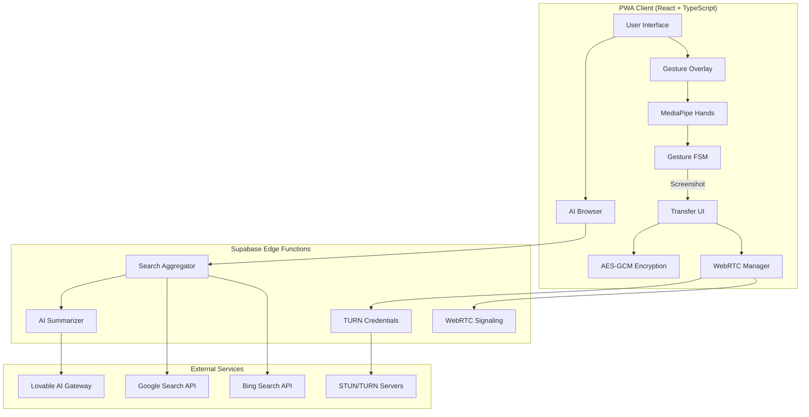
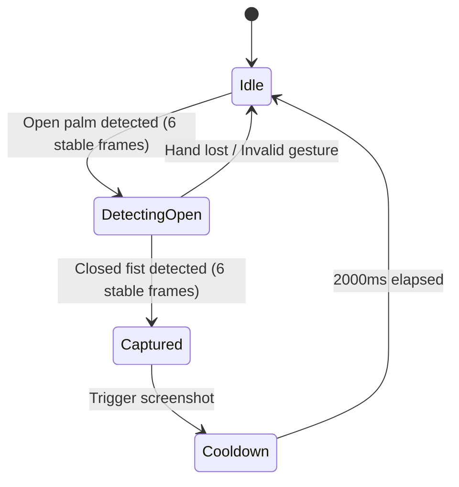
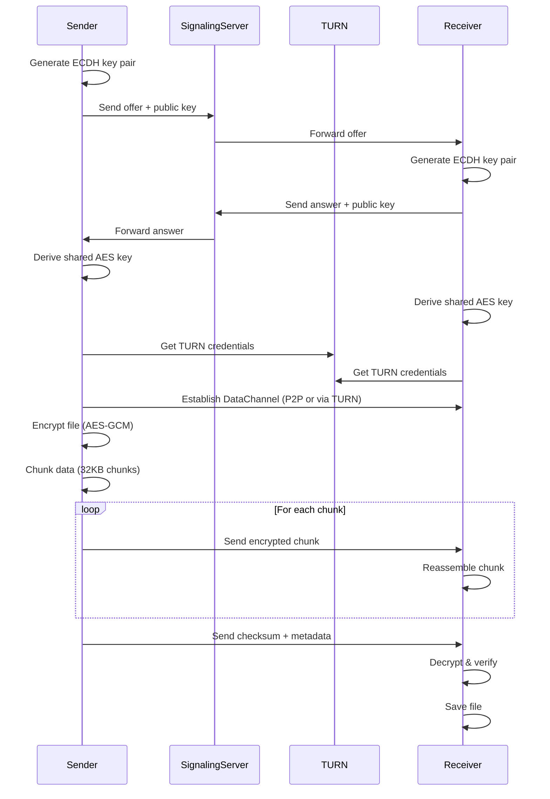
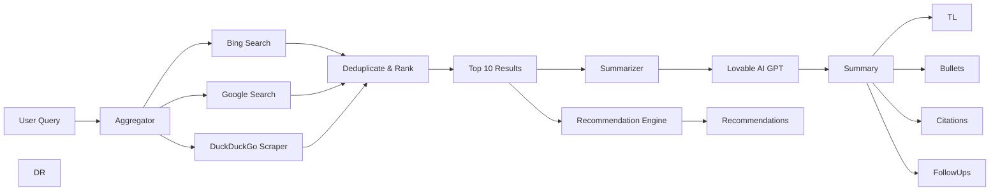

# Chatr Grab & Browse - Architecture

## System Overview



## Gesture Recognition Flow



### Gesture FSM Details

**States:**
- `idle`: No hand detected or invalid gesture
- `detecting_open`: Open palm detected, waiting for fist close
- `captured`: Gesture completed, screenshot triggered
- `cooldown`: Preventing false positives

**Thresholds:**
- Stable frames: 6 (200ms at 30fps)
- Open palm distance: >0.15 (normalized)
- Closed fist distance: <0.08 (normalized)
- Bounding box area: 0.02 - 0.15 (20-40cm from camera)

## WebRTC Transfer Architecture



### Encryption Details

**Key Exchange:**
- Algorithm: ECDH (P-256 curve)
- Ephemeral keys (generated per transfer)
- Shared secret derived via ECDH

**Data Encryption:**
- Algorithm: AES-GCM-256
- IV: 12 bytes random per message
- Auth tag: 16 bytes (GMAC)
- Chunk size: 32KB

**Integrity:**
- SHA-256 checksum of original file
- GMAC authentication per chunk
- Sequence numbers for chunk ordering

## AI Search Pipeline



### Summarization Prompt

```
You are an expert summarizer. Given search results, produce:
1) A 2-line TL;DR with inline citation markers like [1]
2) 6 bullet points summarizing key info with citations
3) 3 suggested follow-up questions
4) Confidence score (0-1)
5) Extract top 5 source citations

Format as JSON:
{
  "tldr": "...",
  "bullets": ["...", "..."],
  "followUps": ["...", "...", "..."],
  "confidence": 0.85,
  "citations": [{"text": "Source 1", "url": "..."}]
}
```

### Recommendation Scoring

```
score = 0.5 * keyword_similarity + 0.3 * recency_boost + 0.2 * position_score

where:
- keyword_similarity: Jaccard similarity of query keywords vs result text
- recency_boost: 1 / (result_position + 1)
- position_score: Source priority (Google=1.2x, Bing=1.0x)
```

## Performance Budgets

| Metric | Target | Critical |
|--------|--------|----------|
| Gesture Latency | <200ms | <300ms |
| Screenshot Capture | <500ms | <1000ms |
| WebRTC Connection | <3s | <5s |
| File Transfer (10MB, local) | <1s | <2s |
| Search Aggregation | <1s | <2s |
| AI Summarization | <2s | <3s |
| Lighthouse Performance | ≥90 | ≥80 |
| Lighthouse Accessibility | ≥90 | ≥80 |

## Security Model

### Threat Model
- **Eavesdropping**: E2E encryption prevents MITM attacks
- **Data exfiltration**: No server-side storage of files
- **Unauthorized access**: Camera/transfer requires explicit consent
- **Privacy**: No PII in analytics, on-device hand detection

### Security Controls
1. **Transport**: TLS 1.3 for signaling
2. **Encryption**: AES-GCM-256 for data
3. **Key Exchange**: ECDH ephemeral keys
4. **Integrity**: SHA-256 checksums + GMAC auth tags
5. **Access Control**: User consent UI for camera/transfers
6. **Secrets Management**: Supabase Secrets for API keys

## Scalability Considerations

### Client-Side
- **MediaPipe**: Runs on WebAssembly, ~25% CPU on mid-range devices
- **WebRTC**: P2P reduces server load
- **Caching**: Service worker caches AI summaries (24h TTL)

### Server-Side
- **Search Aggregation**: Rate limit 10 req/min per user
- **AI Summarization**: Rate limit 5 req/min per user, cache results
- **Signaling**: Auto-cleanup stale signals (5 min TTL)

## Monitoring & Analytics

### Metrics Tracked (Privacy-First)
- Gesture success rate (% captures vs attempts)
- False positive rate (% unintended captures)
- Transfer completion rate
- Average transfer time
- Search query latency
- AI summary latency
- User engagement (searches per session)

### Error Tracking
- Camera permission denials
- WebRTC connection failures
- Encryption errors
- API rate limits

## Browser Compatibility

| Feature | Chrome | Firefox | Safari | Mobile |
|---------|--------|---------|--------|--------|
| MediaPipe Hands | ✅ 90+ | ✅ 88+ | ✅ 14+ | ✅ |
| WebRTC DataChannel | ✅ 90+ | ✅ 88+ | ⚠️ 14+ | ✅ |
| AES-GCM (Web Crypto) | ✅ 90+ | ✅ 88+ | ✅ 14+ | ✅ |
| getUserMedia | ✅ 90+ | ✅ 88+ | ✅ 14+ | ✅ |

⚠️ = Partial support (fallback available)
