# CHATR Platform Vision - 7 Strategic Pillars

This is the **canonical product philosophy map** for CHATR. Use this consistently across all documentation, presentations, and communications.

## Vision Diagram

```mermaid
graph TB
    subgraph CHATR["🌐 CHATR Platform"]
        direction TB
        
        subgraph AI["🧠 AI-First Communication"]
            AI1[Real-time Translation]
            AI2[Smart Reply Suggestions]
            AI3[Voice Transcription]
            AI4[Call Quality Copilot]
        end
        
        subgraph Privacy["🔐 Privacy by Default"]
            P1[E2E Encryption Default]
            P2[No Phone Number Required]
            P3[Disappearing Messages]
            P4[Decentralized Keys]
        end
        
        subgraph Access["🌍 Universal Access"]
            A1[Web + Native Parity]
            A2[Low-Bandwidth Mode]
            A3[Offline-First Design]
            A4[Accessibility Built-in]
        end
        
        subgraph Carrier["📡 Carrier Independence"]
            C1[VoIP over Any Network]
            C2[No SIM Required]
            C3[Multi-Device Native]
            C4[Global Free Calling]
        end
        
        subgraph Reliability["🛡️ Carrier-Grade Reliability"]
            R1[Call State Machine]
            R2[Network Handoff WiFi↔LTE]
            R3[Recovery Controller]
            R4[OEM Battery Survival]
        end
        
        subgraph Emergency["🚨 Safety & Emergency"]
            E1[GSM 911/112 Fallback]
            E2[Call Failure Recovery]
            E3[Missed Call Reconciliation]
            E4[Callback Suggestions]
        end
        
        subgraph Identity["🆔 Identity & Trust"]
            I1[Device-Bound Identity]
            I2[Multi-Device Collision Guard]
            I3[Account Recovery]
            I4[Spam/Abuse Protection]
        end
    end
    
    style CHATR fill:#1a1a2e,stroke:#16213e,color:#eee
    style AI fill:#4a1942,stroke:#893168,color:#fff
    style Privacy fill:#1a4a1a,stroke:#2d6a2d,color:#fff
    style Access fill:#1a3a4a,stroke:#2d5a6a,color:#fff
    style Carrier fill:#4a3a1a,stroke:#6a5a2d,color:#fff
    style Reliability fill:#2a2a4a,stroke:#4a4a6a,color:#fff
    style Emergency fill:#4a1a1a,stroke:#6a2d2d,color:#fff
    style Identity fill:#3a2a4a,stroke:#5a4a6a,color:#fff
```

## The 7 Pillars Explained

| Pillar | Purpose | Key Differentiator |
|--------|---------|-------------------|
| 🧠 AI-First Communication | Intelligence layer | Real-time translation, smart replies |
| 🔐 Privacy by Default | Security foundation | E2E encryption on by default (unlike Telegram) |
| 🌍 Universal Access | Platform reach | Web + Native parity, offline-first |
| 📡 Carrier Independence | Network freedom | No SIM, multi-device, global free |
| 🛡️ Carrier-Grade Reliability | System trust | State machine, handoff, OEM survival |
| 🚨 Safety & Emergency | Critical fallback | GSM 911/112, missed call recovery |
| 🆔 Identity & Trust | User security | Device-bound, collision protection |

## Usage Guidelines

### ✅ USE FOR:
- Website "Why CHATR" section
- Investor deck (early slides)
- Whitepaper introduction
- Team alignment
- Product positioning

### ❌ DO NOT USE ALONE FOR:
- Technical validation
- Carrier discussions
- Regulatory conversations
- Engineering architecture (use separate runtime diagrams)

## Positioning Statement

**CHATR is a premium VoIP messaging platform with AI-first features, carrier-grade reliability, and privacy by default.**

### What We ARE:
- WhatsApp alternative with better privacy
- Premium communication platform
- AI-enhanced messaging/calling
- Hybrid native + web architecture

### What We Are NOT (Yet):
- Full GSM replacement (requires SMS fallback, RCS, regulatory compliance)
- Carrier service
- Telecom operator

---

*Last updated: 2026-01-05*
*Version: 1.0 - Canonical*
